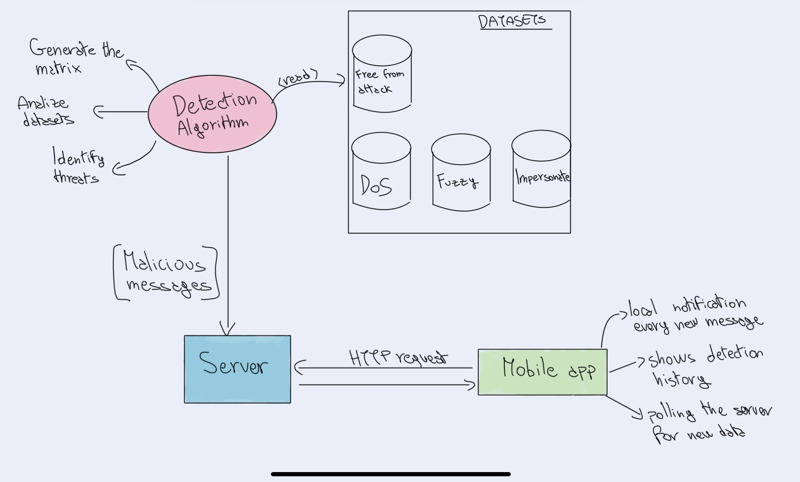
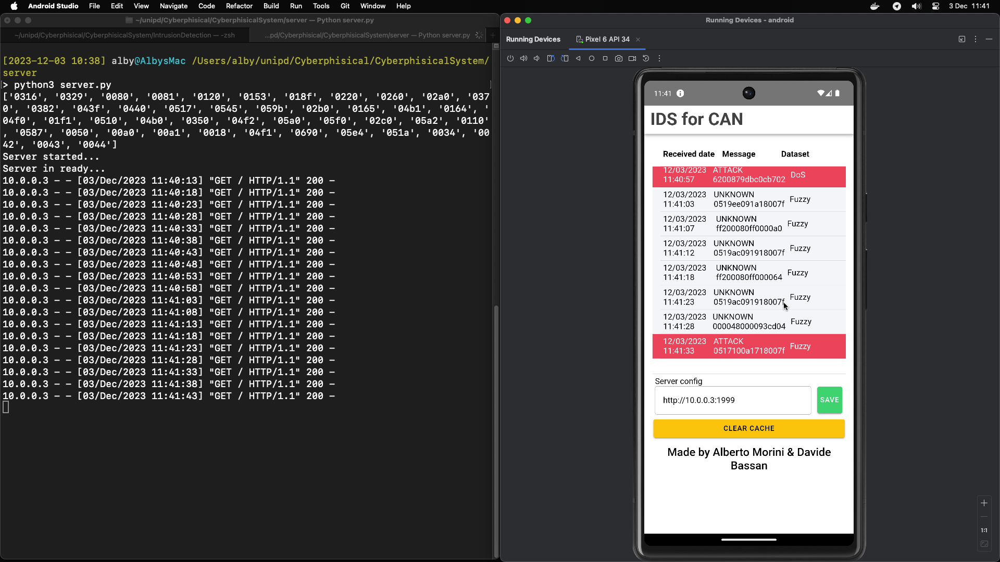
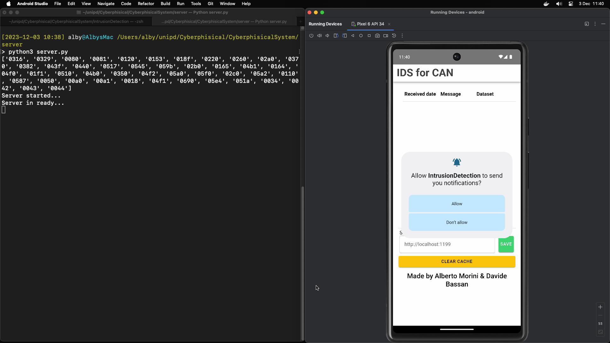
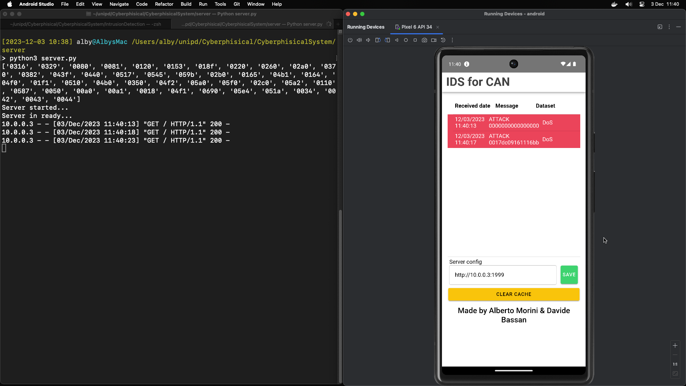
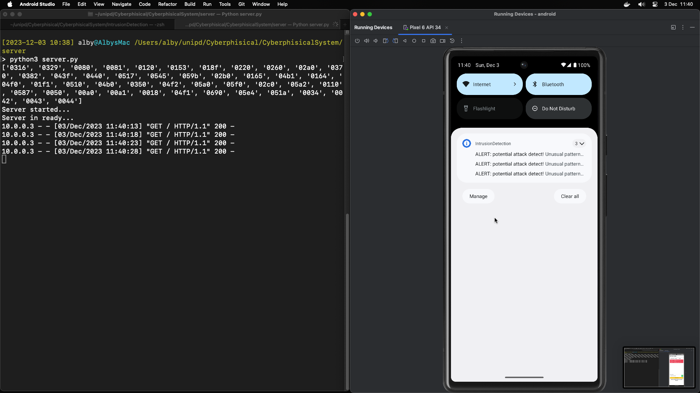

# IDS for CAN - Replication project

> First project of Cyber Physical System and IoT Security - <a href="https://www.unipd.it/en/educational-offer/second-cycle-degree/science?tipo=LM&scuola=SC&ordinamento=2021&key=SC2598&cg=science">*Master degree in Computer Science* </a> 

Replication of the paper - IDS for CAN: A Practical Intrusion Detection System for CAN Bus Security

- link to the paper: https://ieeexplore.ieee.org/document/10001536
- link to the dataset: https://ocslab.hksecurity.net/Dataset/CAN-intrusion-dataset (section 1.3)

**Authors:** 
- Davide Bassan (mat. 2076779) - davide.bassan.1@studenti.unipd.it
- Alberto Morini (mat. 2107783) - alberto.morini@studenti.unipd.it

**Date:** 02 December 2023

**ALL SOURCE CODE IS PUBLIC ON GITHUB (in various branches)**: https://github.com/albertomorini/CyberphisicalSystem <br/>
_For storage reasons we do not provide the datasets of the paper in this repository_

## Table of contents

1. [Abstract](#Abstract)
2. [Detection algorithm](#Intrusion-detection-side)
3. [Mobile app](#Mobile-App)
4. [Conclusions](#Conclusions)


<div style="page-break-after: always;"></div>


## Abstract

We aimed to replicate the work presented in the paper titled "IDS for CAN: A Practical Intrusion Detection System for CAN Bus Security." We have divided the work into two parts:

1. **Intrusion detection**: which analyzes the datasets and identifies potential threats.
2. **Mobile app**:  that, through notifications, alerts the user of the detected threat.

### Architecture

We designed a straightforward architecture consisting of a backend (server with a detection algorithm) and a frontend (web app).

In brief, the backend analyzes the datasets and, upon identifying threats, makes them accessible to clients through an HTTP server.



_Fig1: flowchart of designed architecture_

### Technical specifications

The **backend** is entirely developed in Python.
- *Development and testing were carried out using Python 3.11.4.*

The **frontend** is a web application created with <a href="https://ionicframework.com/">Ionic framework</a> and compiled for Android.
- *Development and testing were conducted with Ionic 7.1.1.*
- *The Android app was built and tested on Android 14 (September 5, 2023) and emulated using API34 in Android Studio Giraffe 2022.3.1 Patch 2.*

<div style="page-break-after: always;"></div>

## Intrusion detection side

### Creation of the matrix
In this phase, we have replicated the algorithm proposed in the paper.

Specifically, from the file `Attack_free_dataset.txt`, we used a regular expression to extract all the IDs of the frames.

```python
def extract_id(file_path):
    """
    Extracts values from the 'ID' column in a text file.
    :file_path (str): The path to the text file.
    @returns List[str]: A list of strings containing the values from the 'ID' column.
    """
    with open(file_path, 'r') as file:
        file_content = file.read()
    ids = re.findall(r'ID:\s+(\w+)', file_content)
    return ids
```

Next, we initialized a matrix of size `N*N`, where `N` is the number of unique IDs that appear in the `Attack_free_dataset.txt` dataset, with all values set to `False`.

Then, we populated the matrix, setting those IDs to `True` that appear one after the other in the dataset. This because we assume that the traffic on the CAN bus is highly recurrent.

```python
def generate_matrix(ids):
    """
    Generation of the matrix
    :ids (List[str]): a list of strings containing the values from the 'ID' column.
    @returns List[List[Boolean]]: a matrix of all transaction appeared on the dataset
    """
    auxiliary_ids = list(dict.fromkeys(ids))

    matrix_size = len(auxiliary_ids)
    boolean_matrix = [[False] * matrix_size for _ in range(matrix_size)]

    for i in range(len(ids)-1):
        row_index = auxiliary_ids.index(ids[i])
        column_index = auxiliary_ids.index(ids[i+1])
        boolean_matrix[row_index][column_index] = True

    return boolean_matrix, auxiliary_ids
```
<div style="page-break-after: always;"></div>


### Threat detection
We have evaluated the algorithm on three different subset of frames

- `DoS_attack_dataset.txt`
- `Fuzzy_attack_dataset.txt`
- `Impersonation_attack_dataset.txt`

To accomplish this, we checked if subsequent IDs appeared in one of these subsets, which is also present in the `Attack_free_dataset.txt` dataset. In other words, in the matrix built previously, if the value is `True` at position `[id][next_id]`, then the IDs is considered to have appeared after the other.

If the ID does not exist in the matrix, or if the value in the matrix is `False`, it is added to a list of potential dangerous messages.

```python
    [...]
    if actual_id not in ids or next_id not in ids:
        threat_len += 1
        batch_threat.append(dataset[i])
        if actual_id not in ids:
            id_to_be_saved.append(actual_id)
        if next_id not in ids:
            id_to_be_saved.append(next_id)
    else:
        row = ids.index(actual_id)
        column = ids.index(next_id)

        if not matrix[row][column]:
            threat_len += 1
            batch_threat.append(dataset[i])
            
    counter += 1
    [...]
```

We have divided the evaluation into batches to calculate a `BATCH_RATIO` of threat. Additionally, we have fixed a threshold to ignore false positives

 Specifically, if a batch has a `BATCH_RATIO` lower than a certain threshold, we consider those messages as false positives. Instead of notifying users of potentially unknown messages, we update the matrix by setting those false positives to true.

```python
def update_matrix(matrix, ids, dataset, adding_ids):
    ids += adding_ids

    for _ in range(len(adding_ids)):
        matrix.append([False] * len(matrix[0]))

    for _ in range(len(adding_ids)):
        matrix[_].extend([False] * len(adding_ids))

    for i in range(0, len(dataset)-1, 2):
        row = ids.index(dataset[i][1])
        column = ids.index(dataset[i+1][1])
        matrix[row][column] = True

    return matrix
```

<div style="page-break-after: always;"></div>

## Mobile app

Otherwise as the paper, we opted to create a web-application which communicate to server via HTTP packets.

We took this decision for many aspects:
- **Portability**: Web applications can be easily built for major mobile operating systems (iOS and Android), providing a significant advantage in code maintainability and extensibility.
- **Real life scenario**: We envisioned the backend detection system installed in cars, possibly integrated with Android Auto or CarPlay, where systems can communicate via Wi-Fi.


### Architecture


The server ''sends'' messages to clients retrieved by the Detection Algorithm, including the property of which dataset the detection is from. 
<br/>
The packet Content-Type has a JSON structure.

```JSON
{
    "timestamp": int,
    "msg_length": int,
    "msg": "VARCHAR",
    "id": id_CANComponent,
    "kind": "ATTACK/UNKNOWN",
    "dataset": "DoS/Fuzzy/Impersonate/..."
}
```
_Packet structure_

- **timestamp**: Represents the time of the detection.
- **msg_length**: Indicates the length of the message.
- **msg**: Contains the actual message content.
- **id**: Represents the ID of the CAN component.
- **kind**: Describes whether the message is categorized as "ATTACK" or "UNKNOWN".
- **dataset**: Specifies the origin dataset, such as "DoS," "Fuzzy," "Impersonate," etc.


**DISCLAIMER**: to simulate a real life scenario, server sends the client a new detection at every request received. <br/>
**In an effective scenario, the server will make detections available in real-time as soon as they are identified.**

Therefore, we allow the client to define the polling time to check the server for new data. Currently, this is set to every 5 seconds.

### Server HTTP

Created using Python and default libraries:

```python
import json #to parse/stringify JSON
from http.server import BaseHTTPRequestHandler, HTTPServer # HTTP server
import sys # to get command line params
import DetectionAlgorithm # the algorithm explained before
```

For simplicity, as soon as the server starts, it launches the detection algorithm on every provided dataset, then saves the detections in a local variable.

The Server provides to clients a limited number of detections, which is indicated at startup via command line by the user. We made this decision to provide detections for every dataset in a reduced time.  
<br/>
*If none parameter is provided, the default number of message for every dataset is 10.*

For example: `$ python3 server.py 5` --> will send a total of 15 packets to the client (5 detections for each dataset)


_Fig2: Entire system running_

<div style="page-break-after: always;"></div>

#### Adding the dataset

As mentioned before, the server also adds the origin dataset to the detections:

```python
detections = {
    "DoS" : DetectionAlgorithm.analyze_traffic(matrix,aux_ids, datasetExtractions["DoS"]),
    "Fuzzy" : DetectionAlgorithm.analyze_traffic(matrix,aux_ids, datasetExtractions["Fuzzy"]),
    "Impersonate" : DetectionAlgorithm.analyze_traffic(matrix,aux_ids, datasetExtractions["Impersonate"]),
}

for i in detections:    ## for each attack 
        for j in range(limitDetections): 
            detections[i][j]["dataset"]= i
            AllDetections.append(detections[i][j]) #add dataset in the current detection

    return AllDetections
```

### Client application

The mobile application is developed using Ionic framework (in React) and then compiled as an Android APK app.<br/>
*For this test, an iOS app hasn't been created.*

We added some libraries: 

- `@ionic/storage` to store the detection history in the app's cache.
- `@capacitor/local-notifications` to trigger native mobile notifications.
- `moment.js` for easy manipulation of datetime formats.

<div style="page-break-after: always;"></div>

#### Life cycle

App starts asking the permission, then start polling the server which socket needs to be configured by user.


_Fig3: App asking for permission for local notification_

As soon IP address and port of the HTTP server are correct, the client retrieves and stores data into the cache; after that, with a "React State" automatically update  the history list.


_Fig4: Mobile app polling the server and retrieving data_

At every new message, apps push in the notification center of Android the new alert.

_Fig5: The notification messages in the notification bar_

<div style="page-break-after: always;"></div>

#### Messages

At every detection received, client baptize the message with a timestamp (called "receptionTS"). This information can be very useful in future thus to measure potential delay/latency of the system.
```js
res.data.forEach(message => { //res.data is an array of message, forEach one show a notification
    showLocalNotification(message.id, message.kind, message.msg); //trigger the android notification

    message.receptionTS = moment().format("DD/MM/YYYY HH:mm:ss"); //baptize the reception timestamp
})
```

Local notifications, as well as the detection history, are categorized into two groups/kinds: "attacks" and "unkonwn traffic", as did in the paper. <br/>
This information is defined by the Detection Algorithm and than the app basically shows the respective message.

```js
async function showLocalNotification(id, kindMessage = "NODATA", CANMessage) {
        let tmpBody;
        if (kindMessage == "ATTACK") {
            tmpBody = "Invalid messages have been detected. This may indicate a bus error or an attack."
        } else if (kindMessage == "UNKNOWN") {
            tmpBody = "Unusual patterns of messages have been detected. This may be the result of unusual activity, or it may indicate an attack."
        }

        let options = {
            notifications: [{
                id: id,
                title: "ALERT: potential attack detect!",
                body: tmpBody + "\n CAN MESSAGE: " + CANMessage
            }]
        }

        try {
            await LocalNotifications.schedule(options); //SHOW NOTIFICATION
        } catch (ex) {
            console.log(ex);
        }
    }
```


In the mobile app, detections have a red background if categorized as "Attack" and a light grey background if identified as "Unusual traffic". <br/>
This visual distinction aids users in quickly recognizing the severity of each detection.

<div style="page-break-after: always;"></div>

## Conclusions

In conclusion, some critical thought about the system created:

- It is crucial that the dataset used to build the matrix is representative, comprehensive, and free of attacks. The algorithm's performance largely depends on the quality of the dataset.
- The only negative observation that we need to make is about energy consumption of Wi-Fi, Bluetooth is lighter and probably available on more vehicles.
- HTTP is an insecure protocol; we adopt it for simplicity but strongly recommend using an SSL certificate (even a self-signed one) to enable HTTPS.

### Data of detection

We have set the `BATCH_SIZE` to `100`, the attack `THRESHOLD` to `0.05`, and the false-positive `THRESHOLD` to `0.02`. This means that if more than 5 percent of the messages in every 100-message batch do not appear in the original matrix, it is highly likely that an attack is in progress. If there are less than 5% but more than 2%, it is possible that an attack is occurring, but further investigation is needed. If it is less than 2%, they are flagged as false positives and subsequently ignored, updating the matrix.

With the available datasets, the replicated algorithm detected numerous malicious messages:

- 605,379 out of 656,579 messages for the DoS attack (numerically aligned with a Denial of Service attack).
- 21,890 out of 591,900 messages for the Fuzzy attack.
- 18,101 out of 995,427 messages for the Impersonate attack.

It is notable that the DoS attack is more prominently detected, as it generates entirely random traffic with IDs that do not exist in the `Attack_free_dataset.txt`. On the other hand, the Fuzzy and Impersonate attacks are more challenging to detect, as they sometimes create traffic that is similar to the traffic present in the constructed matrix.
